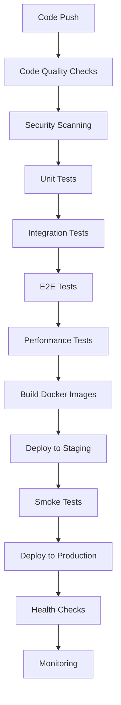

# CI/CD Pipeline Documentation
## Hospital Management System - 2025 DevOps Standards

This document provides comprehensive guidance for the Continuous Integration and Continuous Deployment pipeline for the Hospital Management System.

## 🚀 Pipeline Overview

The CI/CD pipeline is built using GitHub Actions and follows modern DevOps practices with automated testing, security scanning, and deployment strategies.

### Pipeline Architecture



## 📁 Workflow Files Structure

```
.github/workflows/
├── ci-cd.yml                  # Main CI/CD pipeline
├── dependency-update.yml      # Automated dependency updates
├── release.yml               # Automated release management
└── performance.yml           # Performance testing pipeline
```

## 🔄 Main CI/CD Pipeline

### Workflow Triggers

The main pipeline (`ci-cd.yml`) is triggered by:

- **Push to main/develop/staging branches**
- **Pull requests to main/develop**
- **Release publications**

### Pipeline Stages

#### 1. Code Quality & Security
```yaml
- Python code formatting (Black)
- Import sorting (isort)
- Linting (flake8, mypy)
- JavaScript/TypeScript linting (ESLint)
- Security scanning (bandit, npm audit)
- Dependency vulnerability checks
```

#### 2. Backend Testing
```yaml
- Unit tests with coverage
- Integration tests
- Database migration tests
- API endpoint tests
- Performance benchmarks
```

#### 3. Frontend Testing
```yaml
- Unit tests (Jest/Vitest)
- Component tests (React Testing Library)
- Type checking (TypeScript)
- Build verification
- Bundle size analysis
```

#### 4. End-to-End Testing
```yaml
- Full application testing
- User journey validation
- Cross-browser testing
- Mobile responsiveness
- Accessibility testing
```

#### 5. Security Scanning
```yaml
- Container vulnerability scanning (Trivy)
- Code analysis (CodeQL)
- Dependency scanning
- Secret detection
- License compliance
```

#### 6. Build & Deploy
```yaml
- Docker image building
- Multi-architecture support
- Image optimization
- Registry publishing
- Environment deployment
```

## 🔧 Configuration Files

### Renovate Configuration (`.github/renovate.json`)

Automated dependency management with:

- **Scheduled Updates**: Weekly dependency updates
- **Security Patches**: Immediate security vulnerability fixes
- **Grouped Updates**: Related packages updated together
- **Auto-merge**: Safe updates automatically merged
- **Custom Rules**: Framework-specific update strategies

```json
{
  "schedule": ["before 6am on Monday"],
  "packageRules": [
    {
      "matchUpdateTypes": ["patch"],
      "automerge": true
    },
    {
      "matchPackageNames": ["django", "react"],
      "reviewers": ["@SherryMaster"]
    }
  ]
}
```

### Lighthouse CI Configuration (`.lighthouserc.json`)

Performance monitoring with:

- **Performance Thresholds**: Minimum scores for deployment
- **Accessibility Standards**: WCAG compliance checks
- **SEO Optimization**: Search engine optimization validation
- **Best Practices**: Modern web development standards

## 🧪 Testing Strategy

### Test Pyramid

```
    /\
   /E2E\     <- End-to-End Tests (Few, Slow, High Confidence)
  /______\
 /        \
/Integration\ <- Integration Tests (Some, Medium, Medium Confidence)
\____________/
/            \
/  Unit Tests  \ <- Unit Tests (Many, Fast, Low Confidence)
\______________/
```

### Backend Testing

#### Unit Tests
```python
# Example: Patient model tests
class PatientModelTest(TestCase):
    def test_patient_creation(self):
        patient = Patient.objects.create(
            user=self.user,
            date_of_birth='1990-01-01',
            phone='+1234567890'
        )
        self.assertEqual(patient.age, 35)
```

#### Integration Tests
```python
# Example: API endpoint tests
class AppointmentAPITest(APITestCase):
    def test_create_appointment(self):
        response = self.client.post('/api/appointments/', {
            'doctor': self.doctor.id,
            'appointment_date': '2025-07-01',
            'appointment_time': '10:00:00'
        })
        self.assertEqual(response.status_code, 201)
```

### Frontend Testing

#### Component Tests
```javascript
// Example: Component testing
import { render, screen } from '@testing-library/react';
import AppointmentCard from './AppointmentCard';

test('renders appointment information', () => {
  const appointment = {
    id: 1,
    doctor: 'Dr. Smith',
    date: '2025-07-01',
    time: '10:00'
  };
  
  render(<AppointmentCard appointment={appointment} />);
  expect(screen.getByText('Dr. Smith')).toBeInTheDocument();
});
```

#### E2E Tests
```javascript
// Example: Playwright E2E test
test('user can book appointment', async ({ page }) => {
  await page.goto('/login');
  await page.fill('[data-testid=email]', 'patient@example.com');
  await page.fill('[data-testid=password]', 'password');
  await page.click('[data-testid=login-button]');
  
  await page.goto('/appointments/new');
  await page.selectOption('[data-testid=doctor]', 'Dr. Smith');
  await page.fill('[data-testid=date]', '2025-07-01');
  await page.click('[data-testid=submit]');
  
  await expect(page.locator('[data-testid=success-message]')).toBeVisible();
});
```

## 🚀 Deployment Strategy

### Environment Progression

1. **Development** → 2. **Staging** → 3. **Production**

### Deployment Methods

#### Blue-Green Deployment
```yaml
# Zero-downtime deployment strategy
- Deploy to green environment
- Run health checks
- Switch traffic to green
- Keep blue as rollback option
```

#### Rolling Deployment
```yaml
# Gradual deployment strategy
- Deploy to subset of instances
- Monitor health and performance
- Gradually increase deployment
- Complete when all instances updated
```

### Environment Configuration

#### Staging Environment
- **Purpose**: Pre-production testing
- **Data**: Sanitized production data
- **Monitoring**: Full monitoring stack
- **Access**: Internal team only

#### Production Environment
- **Purpose**: Live user traffic
- **Data**: Real production data
- **Monitoring**: 24/7 monitoring
- **Access**: Restricted access

## 📊 Performance Testing

### Load Testing with Locust

```python
# Example: API load testing
class HospitalUser(HttpUser):
    wait_time = between(1, 3)
    
    @task(3)
    def view_appointments(self):
        self.client.get("/api/appointments/")
    
    @task(1)
    def create_appointment(self):
        self.client.post("/api/appointments/", json={
            "doctor": 1,
            "date": "2025-07-01",
            "time": "10:00:00"
        })
```

### Performance Metrics

- **Response Time**: < 200ms for API endpoints
- **Throughput**: > 1000 requests/second
- **Error Rate**: < 0.1%
- **Availability**: > 99.9%

### Frontend Performance

- **Lighthouse Score**: > 90
- **First Contentful Paint**: < 1.5s
- **Largest Contentful Paint**: < 2.5s
- **Cumulative Layout Shift**: < 0.1

## 🔒 Security Pipeline

### Security Scanning Tools

1. **Trivy**: Container vulnerability scanning
2. **CodeQL**: Static code analysis
3. **Bandit**: Python security linting
4. **npm audit**: Node.js dependency scanning
5. **OWASP ZAP**: Dynamic security testing

### Security Gates

```yaml
# Security requirements for deployment
- No critical vulnerabilities
- No hardcoded secrets
- All dependencies up-to-date
- Security headers configured
- Authentication properly implemented
```

## 📈 Monitoring & Alerting

### Metrics Collection

- **Application Metrics**: Response times, error rates
- **Infrastructure Metrics**: CPU, memory, disk usage
- **Business Metrics**: User registrations, appointments
- **Security Metrics**: Failed logins, suspicious activity

### Alerting Rules

```yaml
# Example: High error rate alert
- alert: HighErrorRate
  expr: rate(http_requests_total{status=~"5.."}[5m]) > 0.1
  for: 5m
  annotations:
    summary: "High error rate detected"
    description: "Error rate is {{ $value }} errors per second"
```

## 🔄 Release Management

### Semantic Versioning

- **Major**: Breaking changes (v2.0.0)
- **Minor**: New features (v1.1.0)
- **Patch**: Bug fixes (v1.0.1)

### Automated Releases

```yaml
# Conventional commits trigger releases
feat: new appointment booking feature    # Minor release
fix: resolve login issue                 # Patch release
feat!: redesign user interface          # Major release
```

### Release Process

1. **Code Review**: All changes reviewed
2. **Testing**: Full test suite passes
3. **Security**: Security scans pass
4. **Documentation**: Release notes generated
5. **Deployment**: Automated deployment
6. **Verification**: Post-deployment checks

## 🛠️ Development Workflow

### Branch Strategy

```
main (production)
├── develop (integration)
│   ├── feature/user-authentication
│   ├── feature/appointment-booking
│   └── bugfix/login-validation
└── hotfix/security-patch
```

### Pull Request Process

1. **Create Feature Branch**: From develop
2. **Implement Changes**: With tests
3. **Run Local Tests**: Ensure quality
4. **Create Pull Request**: With description
5. **Code Review**: Team review
6. **CI Pipeline**: Automated checks
7. **Merge**: After approval

### Quality Gates

- [ ] All tests pass
- [ ] Code coverage > 80%
- [ ] No security vulnerabilities
- [ ] Performance benchmarks met
- [ ] Documentation updated

## 📋 Troubleshooting

### Common Issues

#### Pipeline Failures

1. **Test Failures**
   ```bash
   # Check test logs
   gh run view --log
   
   # Run tests locally
   npm test
   python manage.py test
   ```

2. **Build Failures**
   ```bash
   # Check Docker build
   docker build -t test-image .
   
   # Verify dependencies
   npm ci
   pip install -r requirements.txt
   ```

3. **Deployment Failures**
   ```bash
   # Check deployment logs
   kubectl logs deployment/hospital-backend
   
   # Verify health checks
   curl -f http://api.hospital.com/health/
   ```

### Performance Issues

1. **Slow Tests**
   - Parallelize test execution
   - Use test databases
   - Mock external services

2. **Large Images**
   - Multi-stage builds
   - Minimize layers
   - Use alpine base images

3. **Long Deployments**
   - Optimize build cache
   - Use rolling deployments
   - Implement health checks

---

## 📋 CI/CD Checklist

### Pre-deployment
- [ ] All tests passing
- [ ] Security scans clean
- [ ] Performance benchmarks met
- [ ] Documentation updated
- [ ] Environment variables configured
- [ ] Database migrations tested

### Post-deployment
- [ ] Health checks passing
- [ ] Monitoring active
- [ ] Error rates normal
- [ ] Performance metrics good
- [ ] User acceptance testing
- [ ] Rollback plan ready

---

*This CI/CD pipeline ensures reliable, secure, and efficient delivery of the Hospital Management System following 2025 DevOps best practices.*
